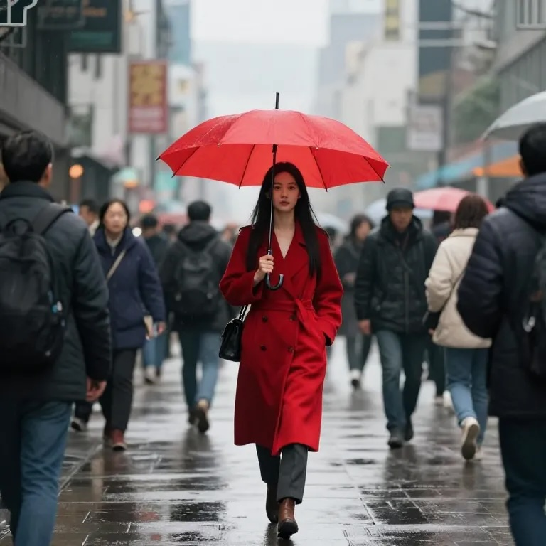

# Image Attributes Fixture

This fixture validates the SBS 1.1 image display attributes.

## Scale + Align

{ align=center, scale=0.5 }

## Scale (another float)

{ align=left, scale=1.25 }

## Width/Height (scale omitted)

{ align=right, width=240, height=160 }

## Width Only

{ width=220 }

## Height Only

{ height=180 }

## Invalid Values (should be ignored)

{ align=banana, scale=0, width=-10, height=abc }